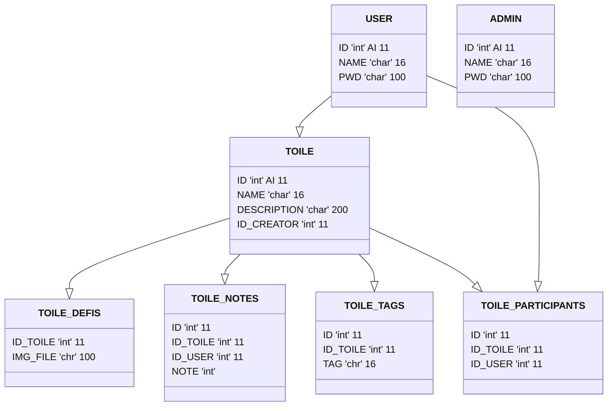

# CollectArt

Créer des toiles (pixel art) numérique vides et les modifier soit tous seul soit avec d'autres personnes, ainsi que voter pour les meilleurs d'entres elles.

Les toiles en mode défis permettent de s'ammuser à immiter des images si l'on manqe d'inspiration pour commencer de zéro.

## base de données

## auteurs (groupe 5):

Titouan, Ludovic, Christer, Nathan

L1 MISPI, 2024-2025
